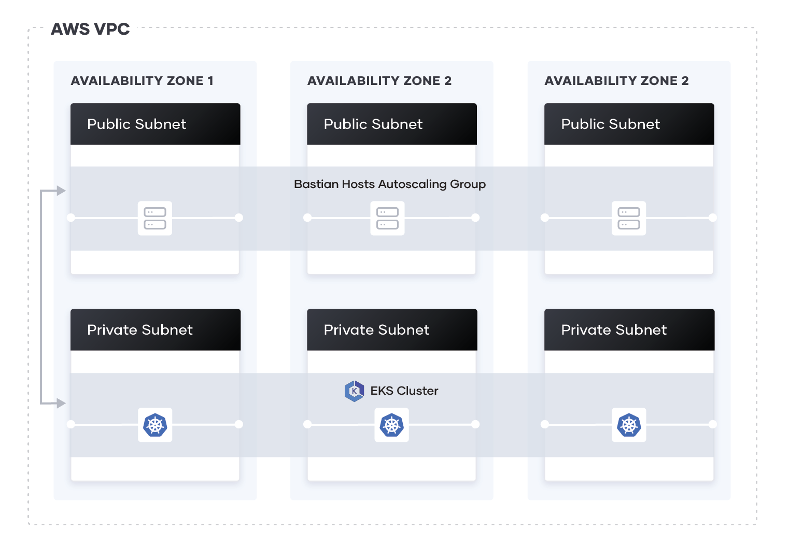

# Solution

The repo contains two folders, The eks-cluster to provision the eks cluster and the argo cd to install argo cd in the cluster

## Architecture of EKS

* The VPC contains three public and private subnets. 
* The configuration for the vpc can be find [here](./eks-cluster/vpc.tf)





* The eks uses two worker groups, with each each worker group contains a single 2  t2.small

To run terrform script for eks

run the code below and pass in the apporiate variable which can be find in [vars.tf](./eks-cluster/vars.tf)

```
    cd eks-cluster
    terraform init  && terraform plan  
    terraform apply
```
## Argo CD

* Argo cd namespace will be created
* High availability argo cd will be installed on argo cd namespace

To install argo cd

run the code below  and pass in the apporiate variable which can be find in [vars.tf](./argocd/vars.tf)

```
    cd argocd
    terraform init  && terraform plan  
    terraform apply
```

For the terraform to run , aws cli must be configured with access key and secret key.